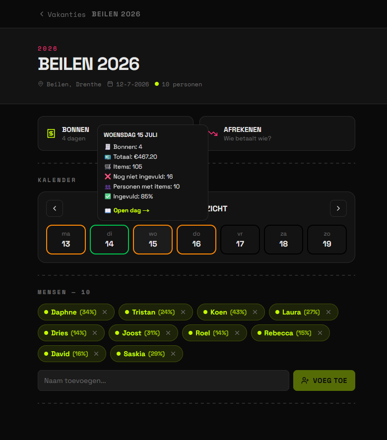
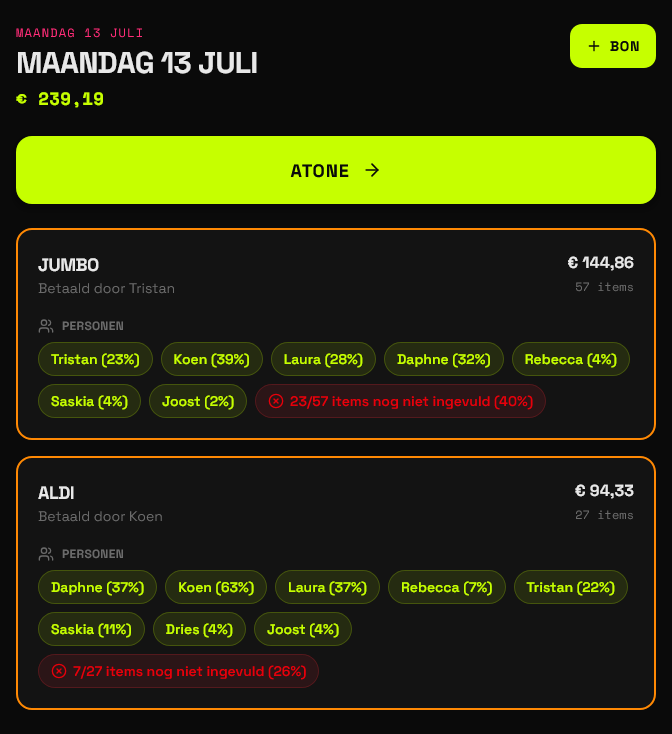
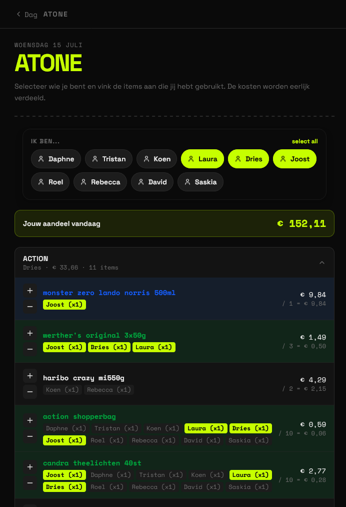
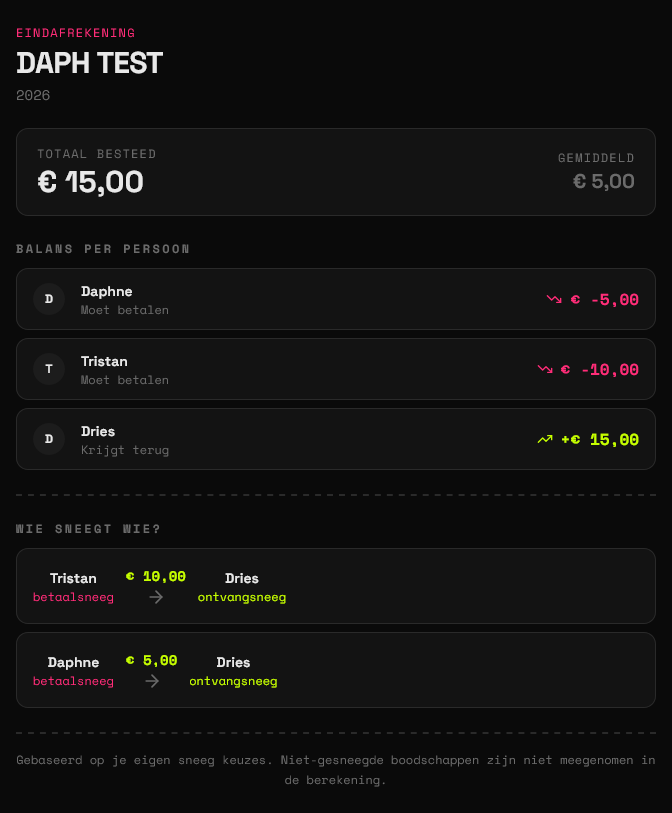

<div align="center">

<p>

  [](#)
  [](#)
  [](#)

  [](#)
  [](#)
  [](#)
  [](#)
  
</p>

# 🧾 Beilen Bonnen

**AI-powered holiday expense tracking with automatic receipt scanning and bill splitting.**

Keeping track of shared expenses during a group holiday usually starts with good intentions and ends with a pile of receipts and confused math.

Beilen Bonnen was built to automate the tedious parts: scan receipts, assign purchases, and always know who owes what.
Turn photos of supermarket receipts into structured items, assign purchases to people, and keep track of who owes what throughout your trip.

</div>

---

## ✨ Features

- 🤖 **AI receipt scanning** using TabScanner
- 🧾 Supports **large supermarket receipts**
- 👥 Assign individual receipt items to different people
- 💰 Automatically calculate balances and settlements
- 📊 Clear overview of shared expenses
- 🐳 Docker Compose setup for quick deployment
- 🌍 Optional Cloudflare Tunnel integration for instant remote access

---

## 🚀 Getting Started

### Prerequisites

- Docker
- Docker Compose
- A TabScanner API key
- (Optional) A Cloudflare Tunnel token

### Configuration

Create a `.env` file in the project root:

```env
TABSCANNER_API_KEY=your_api_key
CLOUDFLARE_TUNNEL_TOKEN=your_tunnel_token
```

| Variable | Required | Description |
|----------|:--------:|-------------|
| `TABSCANNER_API_KEY` | ✅ | API key used to convert receipt photos into structured line items. |
| `CLOUDFLARE_TUNNEL_TOKEN` | ❌ | Automatically exposes the application through a Cloudflare Tunnel. |

### Run

```bash
docker compose up
```

Once the containers have started, open the application in your browser at `localhost:3000`.

---

## 📸 Screenshots

<table>
<tr>
<td width="50%">

### Overview


</td>
<td width="50%">

### Receipts


</td>
</tr>

<tr>
<td width="50%">

### Atone


</td>
<td width="50%">

### Settlement


</td>
</tr>
</table>

---

<div align="center">

Made with ❤️ for stress-free group holidays.

</div>